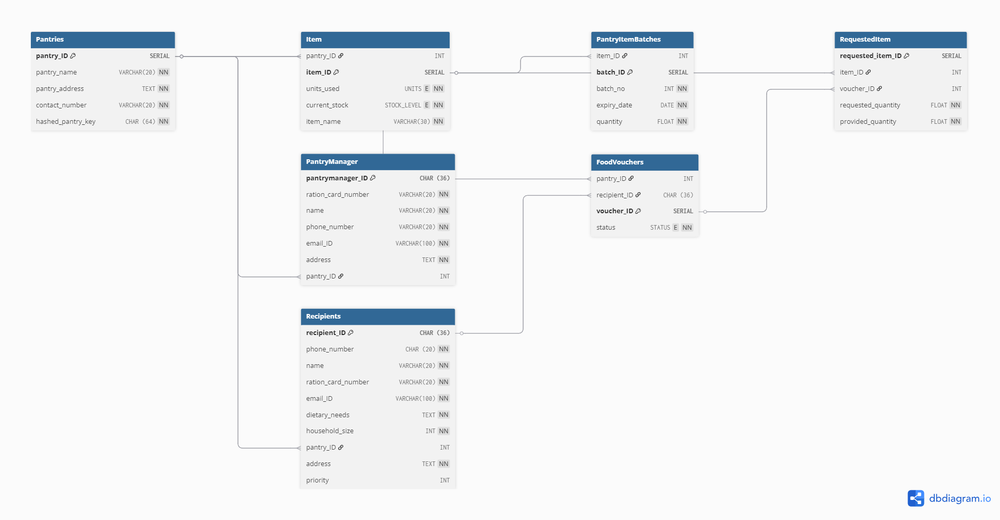

# FeedFirst - Intelligent Food Bank Management System

## The Problem

- In many communities, access to food assistance is **inconsistent and difficult to navigate**.

- On the other side, food pantry managers face challenges in maintaining accurate inventory and tracking food voucher requests.

- The lack of streamlined communication between those concerned often results in,
    - Food waste
    - Stock shortages
    - And missed opportunities for people to get the help they need.

FeedFirst addresses these challenges by creating a centralized system that simplifies the process for both recipients and pantry managers, ensuring that **no one in need is left behind**.

## FeedFirst offers a seamless way for

### Recepients to

- Check for local food pantries  
- Check stock levels for various items  
- Apply for food vouchers  
- Redeem food vouchers for food at the respective pantries

### Pantry managers to

- View and manage pantry inventory
- Maintain expiry dates and stock level
- Register other food pantry voluteers
- Verify and assign recepients a priority level
- Store and process food vouchers requests  

## Tech Stack

- ReactJS
- ExpressJS
- PostgreSQL
- Bootstrap

## Database Schema

